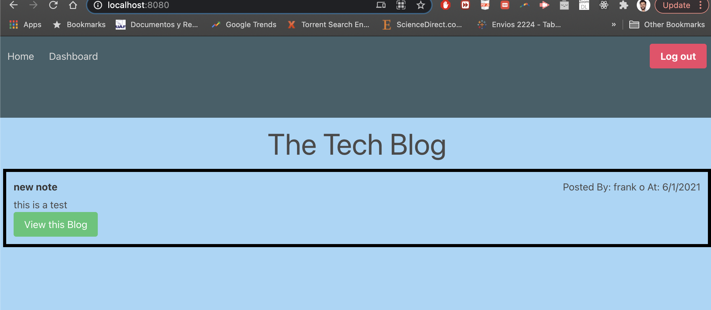

# techBlog

  ## Table of Contents 

  1. [Description](#description) 

  2. [Installation](#installation-guidelines) 

  3. [License](#license) 

  4. [Preview](#preview)

  5. [Question](#questions)  

  ## Description 

  This was made to take simple blog posts to mysql db with CRUD
 
  ## Installation guidelines 

  Have node.js installed on your machine. 
  run npm i from terminal.

  ## License 

  ## MIT
   
  ## Preview

  Link to deployed App: 

  Preview of Home Page  
  

  ## Questions 
  Email me fortega328@github.com